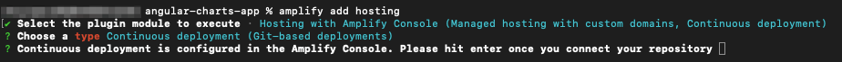
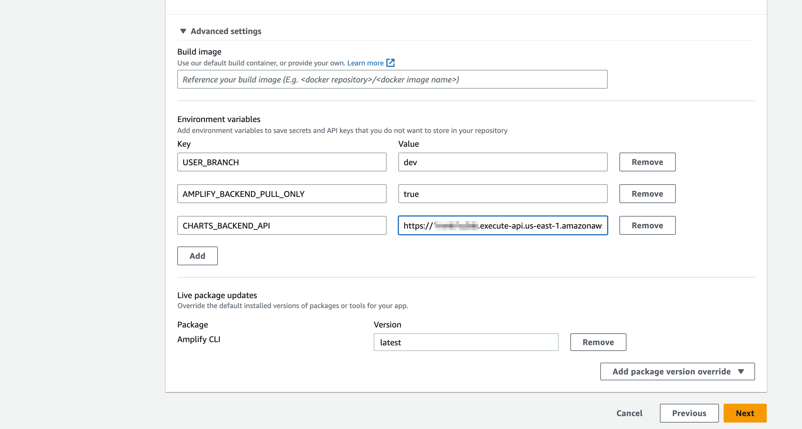

### Angular Charts App Deployment

Angular Charts App is deployed on AWS using AWS Amplify.

CI/CD pipeline is configured using AWS Amplify. 

#### Prerequisite

Make sure we have Amplify CLI up and running, and for installation use the [Amplify Official Website](https://docs.amplify.aws/cli/start/install/)

## Deployment on AWS


### Deployment of the above architecture on AWS
 
#### Step 1: Clone Repository

```console
git clone
cd opensource-microfrontend/angular-charts-app
```

#### Step 2: Install Dependencies 

```console
npm install
```

### Step 3: Initialize AWS Amplify

```console
amplify init
```


### Step 4: Add CI/CD and Deploy App

```console
amplify add hosting
```

Amplify hosting will ask a few questions, select the answers as present in the screenshot:



*After selecting the options, Amplify CLI would open Amplify console on the default web browser.*

#### Step 4a: Setting up Hosting Environment

Click on *Hosting environments* and Select *AWS CodeCommit*. Click "Connect Branch"


#### Step 4b: Setting up Repository

Select *microfrontend-angular-charts-app* repository from the drop down and select *main* branch.


#### Step 4c: Configure the Build Setting

- Select *Environment* as **Dev** from the drop down
- Select an existing service role or create a new one so Amplify Hosting may access your resources.
- Click on *Advanced settings* drop down and set the environment variable **CHARTS_BACKEND_API** (Copy the value of ***APIGatewayURL***) *[(can get from Step 3 in the backend app deployment)](../backend/README.md)*)




#### Step 4d: Setting up Build Setting

Review the setting and click on *Save and Deploy*


### Step 5: Getting the Angular Charts App endpoint

After completing *Step 4d*, come back to the existing terminal and hit enter. You can see the Frontend App Domain. Save this Domain in a text editor, we would be need with when deploying the React Container App.


[Lets' deploy our React Charts Data App.](../react-charts-data-app/README.md)

[Go Back.](../README.md)