### React Container App Deployment

React Container App is the App responsible for Micro-Frontend Apps integration. Both React and Angular apps are being imported as a remote and leveraged in the Container App.

React Container App also uses AWS Cognito for user Authentication.  

AWS Amplify is leveraged hosting the app, configuring the CI/CD, and setting up AWS Cognito for user Authentication.  

#### Prerequisite

- Make sure we have Amplify CLI up and running, and for installation use the [Amplify Official Website](https://docs.amplify.aws/cli/start/install/)

## Deployment on AWS


### Deployment of the above architecture on AWS
 
#### Step 1: Clone Repository

```console
git clone https://github.com/aws-samples/micro-frontend-using-polyglot-javascript-frameworks.git
cd opensource-microfrontend/react-container-app
```

#### Step 2: Install Dependencies 

```console
npm install
```

### Step 3: Initialize AWS Amplify

```console
amplify init
```

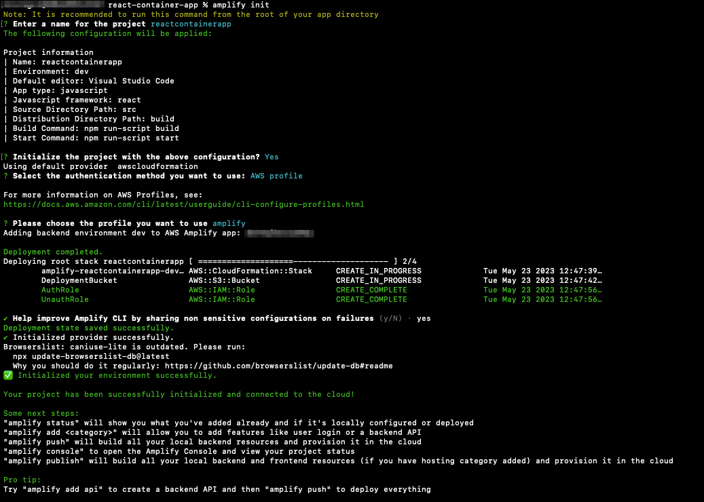

### Step 4: Add Authentication

```console
amplify add auth
```

Select the options as present in the screenshot

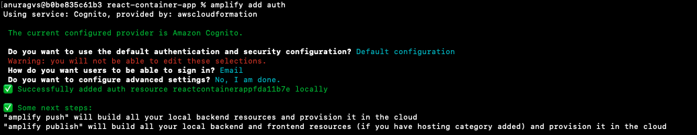

### Step 5: Push local amplify changes to AWS 

Push the local changes to AWS, and Amplify would create resources needed for the Authentication (AWS Cognito, IAM Role, Lambda Function) 

```console
amplify push
```

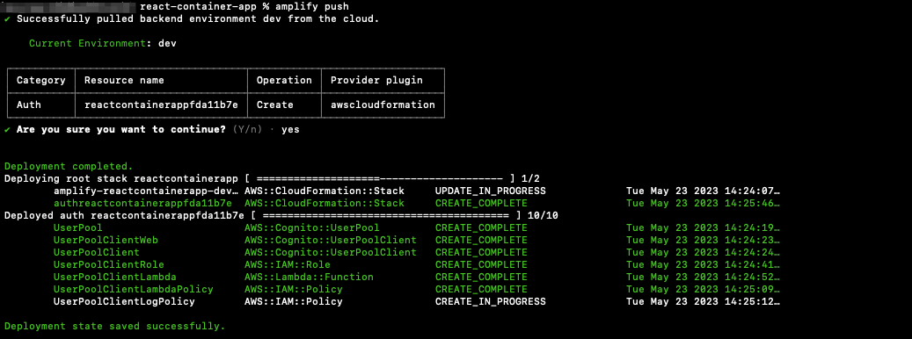

### Step 6: Add CI/CD and Deploy App

```console
amplify add hosting
```

Amplify hosting will ask a few questions, select the answers as present in the screenshot:

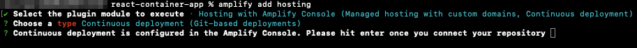

*After selecting the options, Amplify CLI would open Amplify console on the default web browser.*

#### Step 6a: Setting up Hosting Environment

Click on *Hosting environments* and Select *AWS CodeCommit*. Click "Connect Branch"

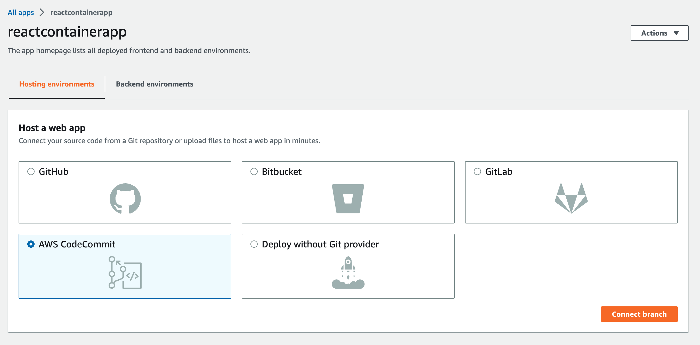

#### Step 6b: Setting up Repository

Select *microfrontend-react-container-app* repository from the drop down and select *main* branch.

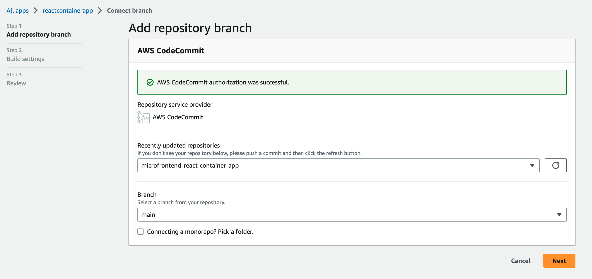

#### Step 6c: Configure the Build Setting

- Select *Environment* as **Dev** from the drop down
- Select an existing service role or create a new one so Amplify Hosting may access your resources.
- Click on *Advanced settings* drop down and set a environment variable for the micro-frontend app **REACT_CHARTS_DATA_APP** (Copy the value of ***React Charts Data App Domain***) *[(Get from Step 5 in the React Charts Data APP deployment)](../react-charts-data-app/README.md)*)
- set another environment variable for the Micro-frontend app **ANGULAR_CHARTS_APP** (Copy the value of ***Angular Charts App Domain***) *[(Get from Step 5 in the Angular Charts APP deployment)](../angular-charts-app/README.md)*)

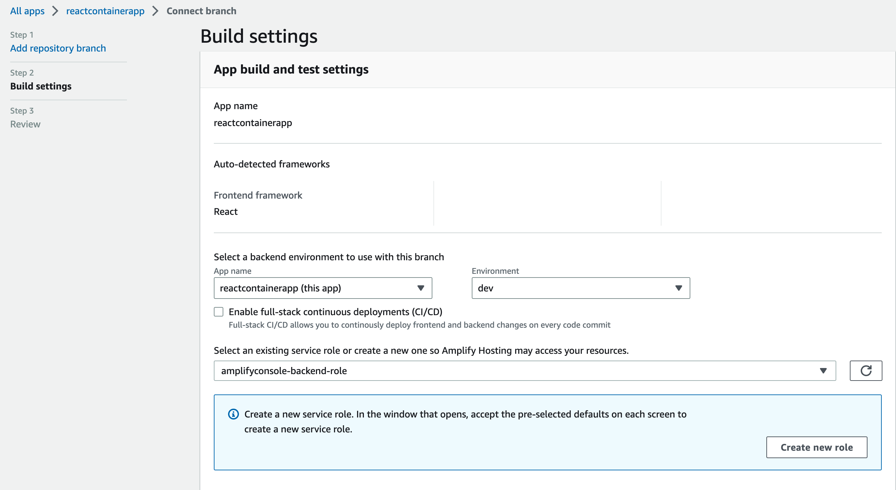
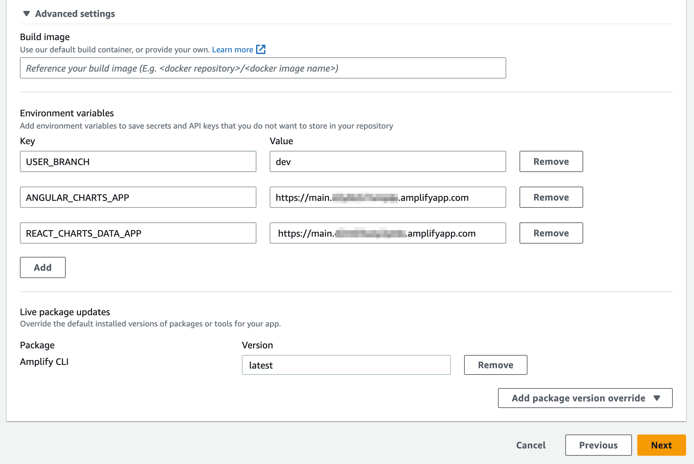

#### Step 6d: Review the CI/CD and Build Setting

Review the setting and click on *Save and Deploy*

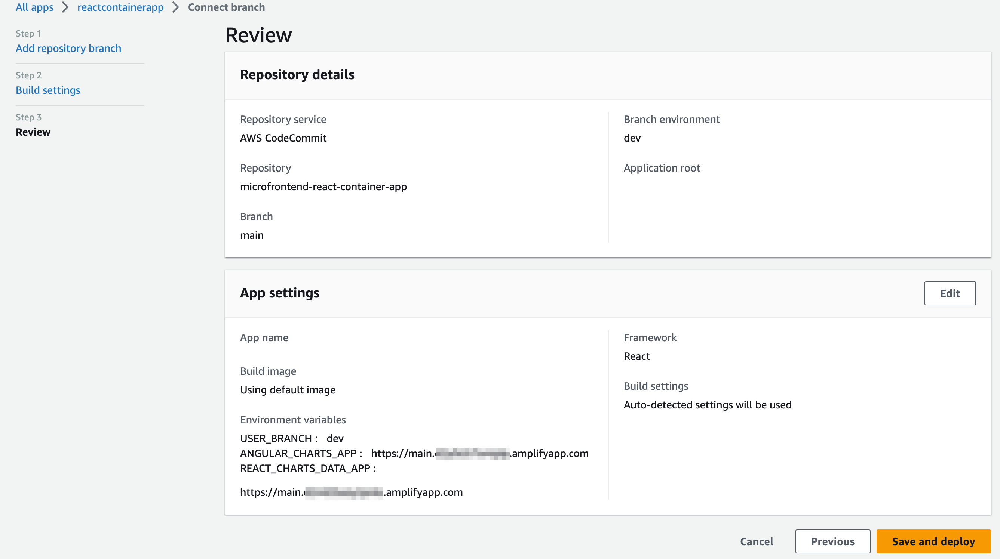

### Step 7: Getting the React Container App endpoint

After completing *Step 6d*, come back to the existing terminal and hit enter. You can see the Frontend App Domain. 

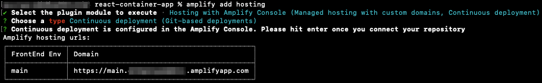

Frontend Domain is the Container application, open it on the Browser and try out the Micro-Frontend App.  

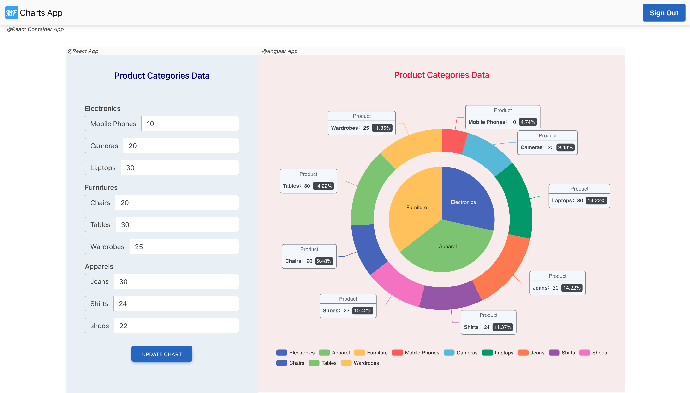

[Lets' go back.](../README.md)